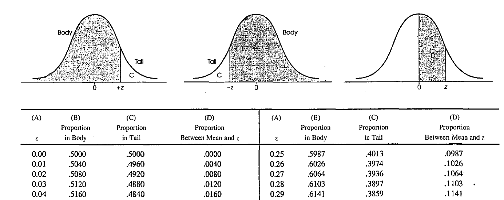

<!-- options(download.file.method="libcurl") -->

```{r setup, include=FALSE}
knitr::opts_chunk$set(
	echo = TRUE,
	message = FALSE,
	warning = FALSE
)
options(digits=3)
library(dplyr)
library(tidyverse)
library(dplyr)
library(tuev)
library(emo)
library(knitr)

```


```{r include=FALSE}
library(readxl)
library(psych)

ornek <- read_excel("ornek.xlsx")$Puan
ornekz <- scale(ornek)


## Plotting Normal Distribution Plots in R with ggplot2:

library(ggplot2)

## Standard normal distribution:

xvalues <- data.frame(x = c(-3, 3))


# Shading from x = -1 to x = 1 (within one std deviation):

dnorm_one_sd <- function(x){
  norm_one_sd <- dnorm(x)
  # Have NA values outside interval x in [-1, 1]:
  norm_one_sd[x <= -1 | x >= 1] <- NA
  return(norm_one_sd)
}


dnorm_two_sd <- function(x){
  norm_two_sd <- dnorm(x)
  # Have NA values outside interval x in [-1, 1]:
  norm_two_sd[x <= -2 | x >= 2] <- NA
  return(norm_two_sd)
}

dnorm_three_sd  <- function(x){
  norm_three_sd <- dnorm(x)
  # Have NA values outside interval x in [-1, 1]:
  norm_three_sd[x <= -3 | x >= 3] <- NA
  return(norm_three_sd)
}

area_one_sd <- round(pnorm(1) - pnorm(-1), 4)
area_one_sd
SND <- ggplot(xvalues, aes(x = x)) + stat_function(fun = dnorm) + 
stat_function(fun = dnorm_three_sd, geom = "area", fill = "lightblue", alpha = 0.3) +
stat_function(fun = dnorm_two_sd, geom = "area", fill = "coral", alpha = 0.3) + 
stat_function(fun = dnorm_one_sd, geom = "area", fill = "green", alpha = 0.3) + 
geom_vline(xintercept = 0, colour="black",linetype="dashed")+
  geom_text(x = 0.5, y = 0.2, size = 3.5, fontface = "bold",
            label = paste0(round((area_one_sd * 100)/2,2), "%")) +
  geom_text(x = -0.5, y = 0.2, size = 3.5, fontface = "bold",
            label = paste0(round((area_one_sd * 100)/2,2), "%"))+
geom_text(x = 1.5, y = 0.05, size = 3.5, fontface = "bold",
          label = paste0(round((pnorm(2)- pnorm(1))* 100,2), "%"))+
  geom_text(x = -1.5, y = 0.05, size = 3.5, fontface = "bold",
            label = paste0(round((pnorm(2)- pnorm(1))* 100,2), "%"))+
geom_text(x =2.3, y = 0.01, size = 3.5, fontface = "bold",
          label = paste0(round((pnorm(3)- pnorm(2))* 100,2), "%"))+
  geom_text(x =-2.3, y = 0.01, size = 3.5, fontface = "bold",
            label = paste0(round((pnorm(3)- pnorm(2))* 100,2), "%"))


zdag <- SND + scale_x_continuous(breaks = c(-3:3)) +
labs(x = "\n z puanları", y = "\n Yüzde", title = "Standart Normal Dağılım") +
  theme(plot.title = element_text(hjust = 0.5,face="bold"), 
        axis.title.x = element_text(face="bold", size = 12),
        axis.title.y = element_text(face="bold", size = 12))

tdag <- SND +    scale_x_continuous(breaks = -3:3, label = c("20","30","40", "50", "60","70","80")) +
labs(x = "\n T puanları", y = "\n Yüzde", title = "Standart Normal Dağılım") +
  theme(plot.title = element_text(hjust = 0.5,face="bold"), 
        axis.title.x = element_text(face="bold", size = 12),
        axis.title.y = element_text(face="bold", size = 12))


```

<br>
<br>
.center[

##  `r fontawesome::fa(name = "handshake")`: Kübra Atalay Kabasakal
<br>
--
<br>

##  `r fontawesome::fa(name = "link")`: [Hacettepe Üniversitesi](https://avesis.hacettepe.edu.tr/katalay)
<br>
--
<br>
]


---
# .hand[içerik]

- Standart puanlar nedir?

  - standart (z) puanları

  - standart (T) puanları
  
  - diğer standart puanlar

- yüzdelik dilim 

- kümülatif yüzdelik

- kesme puanı 


---
## Standart Puanlar

- Öğrencilerin sınavlardan doğru ve yanlış cevaplarına göre hesaplanarak aldıkları pualar **ham puan** olarak adlandırılır. 

--

- Örneğin; **25** soruluk bir testte her doğru cevap **1 puan** ve yanlış ya da boş cevap 0 puan ise **20** doğrusu olan bir öğrencinin bu sınavdan alacağı **ham puan 20** olacaktır.

--

- Eğer bu sınava her doğru cevap **4 puan** ve yanlış ya da boş cevap 0 puan ise bu kez de öğrencinin alacağı **ham puan 80** olacaktır. 

--

- Ham puanlar birbirine göre **daha yüsek – daha düşük olarak değerlendirilmenin ötesinde bir işleve sahip değildirler.**

---
## Standart Puanlar


- Sadece **ham puanlara**
bakarak öğrencilerin puanlarını birbiriyle **karşılaştırmak yanlış** çıkarımlara neden olabilir.

| Bölüm  	|  Öğrenciler 	|  Ham puan 	| 
|---	|---	|---	|---	|---	|---	|
|   A	|   Elif	|   70	| 
|   B	|   Esin	|   35	| 
|   C	|   Emre	|   6	  |   
|   D	|   Ercan	|   30	|


---
## Standart Puanlar


- Sadece **ham puanlara**
bakarak öğrencilerin puanlarını birbiriyle **karşılaştırmak yanlış** çıkarımlara neden olabilir.

| Sınıf  	|  Öğrenciler 	|  Ham puan 	|  En yüksek puan 	|  
|---	|---	|---	|---	|---	|---	|
|   A	|   Elif	|   70	|   100	|  
|   B	|   Esin	|   35	|  50 	|  
|   C	|   Emre	|   6	  |  10	  |  
|   D	|   Ercan	|   30	|  40 	|


---
## Standart Puanlar


- Sadece **ham puanlara**
bakarak öğrencilerin puanlarını birbiriyle **karşılaştırmak yanlış** çıkarımlara neden olabilir.

| Sınıf  	|  Öğrenciler 	|  Ham puan 	|  En yüksek puan 	|  Aritmetik ort. 	|  
|---	|---	|---	|---	|---	|---	|
|   A	|   Elif	|   70	|   100	|  60 	|   
|   B	|   Esin	|   35	|  50 	|  30 	|  
|   C	|   Emre	|   6	  |  10	  |   5	|   
|   D	|   Ercan	|   30	|  40 	|   26	|   


---
## Standart Puanlar


- Sadece **ham puanlara**
bakarak öğrencilerin puanlarını birbiriyle **karşılaştırmak yanlış** çıkarımlara neden olabilir.

| Sınıf  	|  Öğrenciler 	|  Ham puan 	|  En yüksek puan 	|  Aritmetik ort. 	|   Standart sapma	|
|---	|---	|---	|---	|---	|---	|
|   A	|   Elif	|   70	|   100	|  60 	|   10	|
|   B	|   Esin	|   35	|  50 	|  30 	|  5 	|
|   C	|   Emre	|   6	  |  10	  |   5	|   1	|
|   D	|   Ercan	|   30	|  40 	|   26	|   4	|


---

## Standart Puanlar

- Farklı dağılımlara sahip gruplardaki bireylerin ölçme sonuçlarını birbiriyle
karşılaştırabilmek için dağılımların **merkezi eğilim ve değişim ölçülerinin birbirine eşit olması** gerekir.

--

- Eğer iki dağılımın ortalaması ve standart sapması **birbirinden farklıysa,** bu
dağılımların **aynı ortalama ve standart sapmaya sahip bir dağılıma dönüştürülmesi** gerekir.

--

- **Dönüşüm** ölçme sonuçlarının yorumlanmasını kolaylaştırır, **farklı
dağılımlardaki ölçme sonuçlarının birbiriyle karşılaştırılabilmesine olanak** sağlar.

---
## z puanı

- **z Puanı:** Bireyin grubun aritmetik ortalamasının kaç standart sapma üzerinde veya
altında olduğunu belirten puanlardır.

  - Grubun Ortalaması **	$\overline{X}$ = 70**
  - Grubun Standart Sapması  **	$s$= 20**

--

- **90** puan alan bir birey ortalamanın $90-70=20$ puan yani **1
standart sapma üzerinde** puan almıştır. Böylece bu bireyin **z
puanı 1´e eşittir.**

- **50** puan alan bir birey ortalamanın $50-70=-20$ puan yani **1
standart sapma altında** puan almıştır. Böylece bu bireyin **z
puanı -1´e eşittir.**


---
## z puanı


- Ham puanların, **aritmetik ortalaması 0** ve **standart sapması 1** olan puanlara dönüştürülmesiyle elde edilen standart puanlara **z puanı** adı verilir ve **z puanı** aşağıda verilen eşitlik yardımıyla hesaplanır:

$$z=\frac{X-\overline{X}}{s_X}$$
- $X:$ öğrencinin puanı
- $\overline{X} :$ aritmetik ortalama
- $s_X:$ standart sapma

---
## z puanı

- **z** puanının aritmetik **ortalaması 0**, **standart sapması 1´dir**.


  - Grubun Ortalaması **	$\overline{X}$ = 70**
  - Grubun Standart Sapması  **	$s$= 20**

-  **90** puan alan bir bireyin  **z**  puanı = **(90-70)/20 = 1**
-  **50** puan alan bir bireyin   **z**  puanı = **(50-70)/20 = -1**

---
## z puanı


- **z** puanları teorik olarak $-\infty$ ile $+\infty$arasında yer alır. Ancak pratikte yaklaşık olarak puanların **%99'u (-3,+ 3)** aralığında  yer alır. Bu bilgiden anlaşılacağı üzere **z** puanları **negatif ya da pozitif** değerler alabilir.

- **z** puanının işareti $\pm$ ilgili puanın **ortalamanın üstünde veya altında** olduğu ile ilgili bilgi verir.

- işaretinden bağımsız olarak elde edilen  **z** puanları  **x puanı ile aritmetik ortalama arasındaki mesafeye standart sapma** cinsinden ifade eder.

---
## z puanı

- Ortalaması 50.19 ve standart sapması 10.07 olan bir sınava ilişkin ham puanlar [ornek.xlsx](ornek.xlsx) dosyasında yer almaktadır. Bu puanların dağılım aşağıdaki gibidir.

.pull-left[
```{r echo=FALSE, fig.height=5.5, fig.width=8}
hist(ornek, main ="Ham Puan Dağılımı", col = "goldenrod1", xlim = c(0, 100), freq = FALSE, xlab = "Ham Puan", ylab="Yuzde")
curve(dnorm(x, mean=mean(ornek), sd=sd(ornek)), add=TRUE,  col="darkblue", lwd=3)
```
]

.pull-right[
```{r echo=FALSE,fig.height=5.5, fig.width=8}
hist(ornekz, main ="Z Puan Dağılımı", col = "goldenrod1",xlim = c(-5, 5), freq = FALSE, xlab = "z Puanları", ylab="Yuzde")
curve(dnorm(x, mean=mean(ornekz), sd=sd(ornekz)), add=TRUE,  col="darkblue", lwd=3)
```
]

---
## T puanı

- **z puanları** zaman zaman eksi değerler ve ondalıklı değerler alabilmektedirler. Bu değerlerin kullanışlı olmaması nedeniyle, puanlar bir başka standart puan olan **T puanına** dönüştürülür.

--

- **T Puanı:** Aritmetik **ortalaması 50**, **standart sapması 10** olan puanlardır.

  - $T = 50 + (10*z)$

--

- Bir öğrencinin **z puanı  1.2** olduğunda T puanı

  -  $T  = 50 + (10*1.2) = 50 + 12 = 62$

--

- Bir öğrencinin **z puanı -1.2** olduğunda T puanı

  -  $T  = 50 + (10*-1.2) = 50 + 12 = 38$


---
## T puanı

- Ortalaması 50.19 ve standart sapması 10.07 olan bir sınava ilişkin ham puanlar [ornek.xlsx](ornek.xlsx) dosyasında yer almaktadır. Bu puanların dağılım aşağıdaki gibidir.

.pull-left[
```{r echo=FALSE, fig.height=5.5, fig.width=8}
hist(ornek, main ="Ham Puan Dağılımı", col = "goldenrod1", xlim = c(0, 100), freq = FALSE, xlab = "Ham Puan", ylab="Yuzde")
curve(dnorm(x, mean=mean(ornek), sd=sd(ornek)), add=TRUE,  col="darkblue", lwd=3)
```
]

.pull-right[
```{r echo=FALSE,fig.height=5.5, fig.width=8}
ornekT = 50 + 10*ornekz
hist(ornekT, main ="T Puan Dağılımı", col = "goldenrod1",xlim = c(0, 100), freq = FALSE, xlab = "T Puanları", ylab="Yuzde")
curve(dnorm(x, mean=mean(ornekT), sd=sd(ornekT)), add=TRUE,  col="darkblue", lwd=3)
```
]

---
## Diğer Puan Dönüşümleri

- Puan dönüşümlerinde **z** ve **T** puanları en sık kullanılandır.
Bu dönüşümler hariç

- 0-1 dönüşümü
- Maksimum değer dönüşümü

gibi dönüşümlerde bulunmaktadır.


---
## Normal Dağılım ve Standart Puanlar


- **Normal dağılım** istatistikteki en önemli dağılımdır. Bir çok fiziksel, bilişsel, ve psikomotor özelliklerin ölçümleri **normal dağılım** gösterir. 

--

  - Normal dağılım gösteren ölçümler: Çocukların reaksiyon hızları, boy

--

  - Normal dağılım göstermeyen ölçümler: Yaş, kişilerin eğitim düzeyleri, din, ırk

--


---
## Standart Normal Dağılım Ölçüleri

- Herhangi bir dağılımın **aritmetik ortalaması ve standart sapması** biliniyorsa bu dağılımı oluşturan gözlemlerin birbirlerine göre dağılımın neresinde yer aldıklarını kestirebiliriz.

--

- Standart puanları yorumlamak ham puanlara göre daha kolaydır. Standart puanların **aritmetik ortalamaları ve standart sapmaları hep aynıdır, değişmez.**(örnek, z-puan için ortalama 0 standart sapma 1’dir.)

--

- Gözlemleri standart puanlara çevirildiginde dağılımın **şekli değişmez. **

--

- Standart puanlar yorumu kolaylaştırır. 


---
## Standart Normal Dağılım Ölçüleri

- Örneğin 6 yaşında bir çocuk icin **20 kilo 130 cm** dediğimizde bu cocuğun diğer çocuklara karşı zayıf mı şisman mı olduğunu kestiremeyiz. 

- Ama aynı çocuğun boy ve kilosunu **T puanı** olarak ifade edersek bu bize çocuğun diğer çocuklara kıyasla nasıl olduğunu gösterir. 

- Diyelim ki aynı çocucuğun kilosu ve boyu sırasıyla **T puan** cinsinden **30** ve **70.** Bu bize bu ögrencinin **çok zayıf ve çok uzun** olduğunu gösterir.


---
## Yüzde

- iki farklı sınıfta okuyan Elif ve Esin'in knedi sınıfları içindeki konumları kıyaslanabilir. 

- İkisinin de kendi sınıflarında girdikleri sınavdan aldıkları puanlar birbirine eşit ve 65'tir.

| Elif ve Sınıfına İlişkin Puanlar  | Esin ve Sınıfına İlişkin Puanlar|
|---|---|
|  $X=65$ |   $X=65$ |
| $\overline{X}=65$ |   $\overline{X}=70$  |
| $s=5$ |   $s=5$  |
| $z=(65-65)/5=0$ |   $s=(65-70)/5=-1$  |

---
## Yüzde


.pull-left[
```{r echo=FALSE, fig.height=6, fig.width=8, paged.print=TRUE}
zdag
```
]

.pull-right[

- Elif'in **z puanı 0** olduğu için Elif sınıfın **%50**'sinden daha başarılıdır.

- Esin'in **z puanı -1** olduğu için Elif sınıfın **%15.7**'sinden daha başarılıdır.
]

---
## Yüzde

- **z tablosunu** [dosyadan](z_table.pdf) inceleyebilirsiniz.  

.

---
## Standart Normal Dağılım Ölçüleri

- Herhangi bir dağılımı oluşturan her bir gözleme sabit bir sayı eklenirse dağılımın şekli degişmez. Benzer şekilede her bir gözlem belirli bir sayı ile çarpılır ya da bölünürse dağılımın **şekli değişmez.**

.pull-left[
```{r echo=FALSE, fig.height=6, fig.width=8, paged.print=TRUE}
zdag
```
]
.pull-right[

```{r echo=FALSE, fig.height=6, fig.width=8, paged.print=TRUE}
tdag
```

]


---
## Değerlendirme

- **Standart puanlar** öğrencilerin grup içindeki başarı düzeylerini karşılaştırıp bir
puan hesaplaması yaptığından bir **bağıl değerlendirme** şeklidir.

- Seçme ve yerleştirme sınavlarında her bir dersin ortalaması ve standart sapmasına bağlı olarak **öğrencilerin sıralaması** önemli olduğundan puanlamada **standart puanlar tercih
edilmektedir. **

- Ancak eğitsel açıdan bakıldığında, **hedef kazanımlar söz konusu olduğunda** bu puanların kullanılması, **kazanımlara ulaşamayan öğrencilerin de başarılı sayılması sorununa neden olabilir. **

---
## Uygulama - I

-  Matematik sınavından 70 alan bir Elif'in, iki farklı gruptaki konumu için ne  söyleyebiliriz.

- Grup 1 ve Grup 2 ye ilişkin [veriler](Ornek2.xlsx) dosyasında yer almaktadır. Sınava ilişikin iki gruptaki ortalama ve standart sapma aşağıdaki gibidir.

|Grup| f | $\overline{X}$ | $s$ |
|---|---|---|---|
| Grup1  |  50 | 50.1 | 11.0 |
| Grup2  |  50 | 50.0 | 17.4 |


- Elif'in Grup2 için **z** puanı $(70-50)/11=1.82$ 'dir. Elif grubun *%96**'sınden daha başarılıdır.

- Elif'in Grup2 için **z** puanı $(70-50)/14.4=1.15$ 'dir. Elif grubun **%88**'inden daha başarılıdır.

---
## Uygulama - II

- Ortalaması 50.2, standart sapması 10.2 olan bir sınavdan Elif 60, Esin ise 70 olsun. Elif ve Esin'in sıralamadaki yerleri için ne söyleyebilirsiniz?

- Belirtilen sınava ilişkin [veriler](Ornek3.xlsx) dosyasında yer almaktadır. Sınava ilişikin iki gruptaki ortalama ve standart sapma aşağıdaki gibidir.

|| f | $\overline{X}$ | $s$ |
|---|---|---|---|
| Sınav  |  50 | 50.2 | 10.2 |


- Elif'in **z** puanı $(60-50.2)/10.2=0.96$ 'dir. Elif grubun **%83**'ünden daha başarılıdır.
- Esin'in Grup2 için **z** puanı $(70-50.2)/10.2=1.94$ 'dir. Esin'in grubun **%97**'inden daha başarılıdır.


---
## Uygulama - III

- Ortalaması 65 standart sapması 15.8 olan A testi ve ortalaması 65 standart sapması 8.58 olan B testlerinden 70 alan Ahmet’in, gruptaki arkadaşlarına göre B testinde daha başarılı olduğunu
söyleyebilir miyiz? 
- Belirtilen sınavlara ilişkin [veriler](Ornek4.xlsx) dosyasında yer almaktadır. sınavlara ilişikin ortalama ve standart sapma aşağıdaki gibidir.

|Test| f | $\overline{X}$ | $s$ |
|---|---|---|---|
| Test A |  50 | 65.9 | 15.8 |
| Test B  |  50 | 64.9 | 8.58 |

- Ahmet'in A testinden  **z** puanı $(70-65.9)/15.8=0.25$ 'dir. Ahmet grubun %60'ından daha başarılıdır.

- Ahmet'in B testinden  **z** puanı $((70-64.9)/8.58=0.59$ 'dir. Ahmet grubun %73'ünden daha başarılıdır.
---
## Kaynaklar

---
.center[
<br>
<br>
<br>

.hand[Teşekkürler]

`r emo::ji("thanks")`
 
]
```{r include=FALSE}
# xaringanBuilder::build_pdf("mirt.Rmd")
 
```


